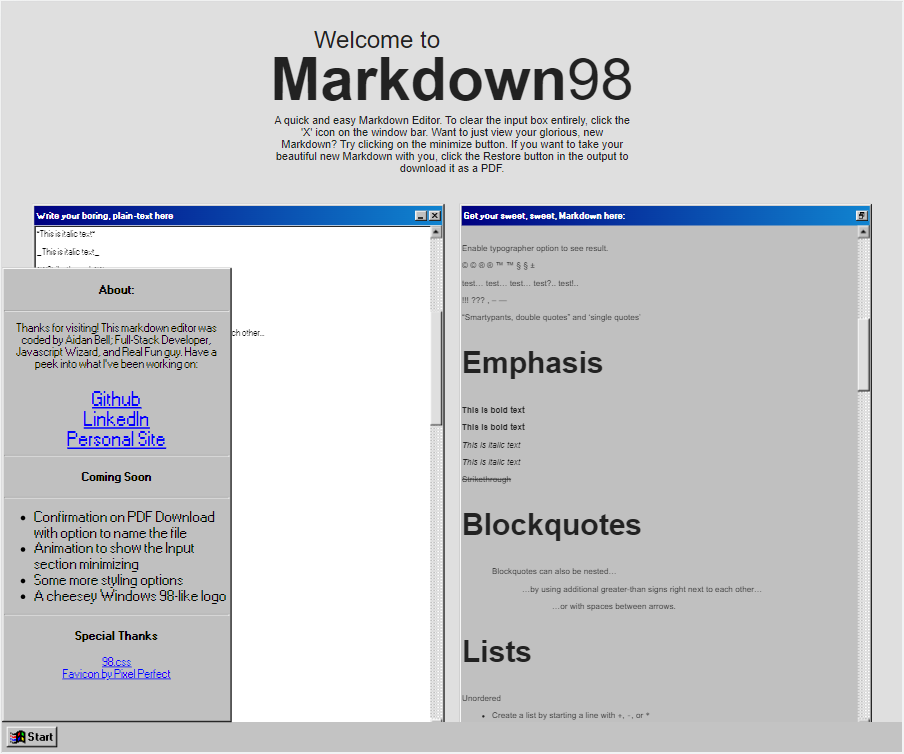

# 🏆🎉 Markdown 98

[https://aidanbell.github.io/Markdowner98/](https://aidanbell.github.io/Markdowner98/)
---

## 📋 The Project

This project was built for a Mintbean Hackathon, and was voted winner by a decent margin! The requirements of the hackathon were simple; build a Markdown editor in under 4 hours that would let users see a preview of their markdown. 
I not only finished on time, but managed to include most of the bonus features in my app. The full project features the following: 

- 🗸 Edit Markdown
- 🗸 Live Preview
- 🗸 Simultanious scoll between input and output
- 🗸 Download as PDF

## 💭 The Process

I started off working with just static HTML/JS/CSS, then quickly scrapped that for an Express app. After wireframing the project, I decided to scrap it again in favor of my favourite front-end framework, React. From the beginning I knew that I'd be using [98.css](https://jdan.github.io/98.css/), which is just a fantastic library for emulating the aesthetics of Windows 98 in a browser. Most of the heavy lifting is handled by [Markdown-It](https://github.com/markdown-it/markdown-it), but getting it all to work together inside of a React app took a good chunk of the 4 hour limit. 

## 🔮 The Future

I'd like to leave this project where it is, since it was a pretty solid achievement for me early in my career. It's currently quite broken, just from years of code rot, but still nice to have a look into. 